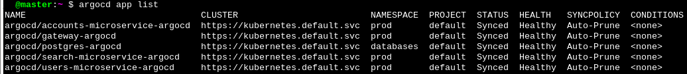

# Argo CD GitOps Repository

## Overview

This repository contains the GitOps configuration used to manage application deployments within my Raspberry Pi Kubernetes cluster.

The objective is to move from imperative deployment workflows toward a declarative GitOps model where the desired cluster state is defined in Git and continuously reconciled by Argo CD.

The platform currently consists of:

* K3s Kubernetes cluster
* Argo CD (Core installation)
* Helm-based application deployments
* Azure Container Registry (ACR)
* Cloudflare Tunnel for external access

---

# Architecture

Argo CD continuously monitors application repositories and reconciles the cluster state whenever changes are detected.

```text
Git Repository
      │
      ▼
 Argo CD
      │
      ▼
 Kubernetes API
      │
      ▼
 Deployments
 Services
 Secrets
 ConfigMaps
 StatefulSets
```

Applications remain independently versioned in dedicated repositories while Argo CD acts as the deployment orchestrator.

---

# Why Argo CD Core

This environment uses the Argo CD Core installation rather than the full platform.

Reasons:

* Reduced resource consumption
* Better suitability for Raspberry Pi hardware
* CLI-driven operation
* Focus on GitOps reconciliation rather than UI features

Installed components include:

* Application Controller
* Repository Server
* ApplicationSet Controller
* Redis

The Argo CD web UI and SSO components were intentionally omitted.

---

# Repository Structure

Each application is managed through a dedicated Argo CD Application manifest.

```text
applications/
├── postgres-argocd.yaml
├── gateway-argocd.yaml
├── accounts-argocd.yaml
├── users-argocd.yaml
└── search-argocd.yaml
```

This approach keeps manifests:

* small
* isolated
* easier to maintain
* independently deployable

---

# GitOps Workflow

The deployment process follows the workflow below:

```text
Developer Push
      │
      ▼
 Application Repository
      │
      ▼
 Argo CD Detects Change
      │
      ▼
 Manifest Generation
      │
      ▼
 Cluster Reconciliation
      │
      ▼
 Application Updated
```

Automatic synchronization is enabled for all applications.

Features used:

* Automated Sync
* Self-Healing
* Automatic Pruning
* Namespace Creation

Example:

```yaml
syncPolicy:
  automated:
    selfHeal: true
    prune: true
  syncOptions:
    - CreateNamespace=true
```

---

# Private Repository Access

Application repositories are private.

Argo CD authenticates using SSH keys registered against GitHub repositories.

Repositories are registered using:

```bash
argocd repo add git@github.com:<repository>.git \
  --ssh-private-key-path ~/.ssh/argocd_id_ed25519
```

This allows Argo CD to securely retrieve deployment manifests and Helm charts.

---

# Managed Applications

Current applications managed by Argo CD:

| Application  | Namespace | Type        |
| ------------ | --------- | ----------- |
| PostgreSQL   | databases | StatefulSet |
| Gateway API  | prod      | Deployment  |
| Accounts API | prod      | Deployment  |
| Users API    | prod      | Deployment  |
| Search API   | prod      | Deployment  |

Each application is sourced directly from its own Git repository.

---

# Container Registry Integration

Container images are stored in Azure Container Registry (ACR).

The registry is private and Kubernetes authenticates through:

* ACR Token
* Kubernetes Docker Registry Secret
* Dedicated Service Account

This allows Argo CD deployments to pull private container images without exposing credentials inside application manifests.

---

# Validation

The deployment was validated through the following tests.

## Argo CD Synchronization

All applications successfully reached:

```text
Status: Synced
Health: Healthy
```

## Database Deployment

Validation included:

* PostgreSQL StatefulSet creation
* Service creation
* Secret management
* Persistent volume usage

## Persistent Storage Verification

A test table was created inside PostgreSQL.

The database pod was then deleted and recreated.

After restart:

* data remained available
* table persisted correctly

This verified proper persistent volume functionality.

## Service-to-Service Communication

Cluster-internal communication was validated using temporary test containers.

Successful tests included:

* User registration
* Authentication
* JWT generation
* User search operations

## Gateway Routing

Requests were validated both:

* Directly against internal services
* Through the Gateway API

This confirmed correct service discovery and reverse proxy routing.

---

# Lessons Learned

Several implementation issues were encountered during deployment:

* Repository URL mismatches (HTTPS vs SSH)
* Incorrect Git branch configuration
* Helm chart path errors
* Namespace inconsistencies
* Private registry authentication failures
* Shared Secret and ConfigMap naming collisions

These issues reinforced the importance of:

* deterministic resource naming
* environment isolation
* repository standardization
* declarative configuration management

---

# Current State

The cluster is currently managed through a GitOps workflow where Argo CD continuously reconciles:

* PostgreSQL database deployment
* Gateway API
* Accounts API
* Users API
* Search API

All applications are deployed from Git repositories and maintained in a synchronized state through automated reconciliation.


